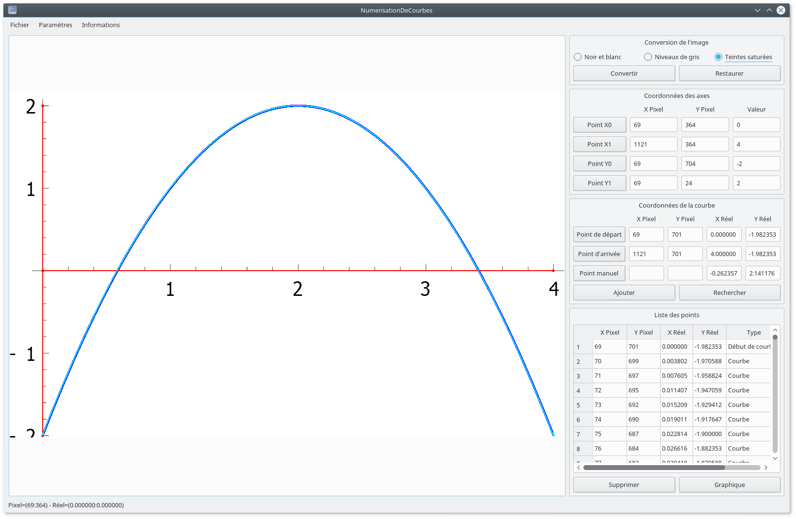

# NumerisationDeCourbes

NumerisationDeCourbes est une application graphique permettant l'extraction des points d'une courbe présente dans un graphique au format image.

Les fonctionnalités principales de l'application sont les suivantes :

 - Sélection d'une image,
 - Définition des axes d'un repère,
 - Définition des extrémités d'une courbe,
 - Recherche et extraction des points d'une courbe,
 - Export des points au format tabulé.

Les fonctionnalités supplémentaires de l'application sont les suivantes :

 - Chargement et sauvegarde d'une étude,
 - Saisie manuelle de points,
 - Conversions graphiques (noir et blanc, niveaux de gris, teintes saturées),
 - Interpolation numérique,
 - Représentation en notation scientifique.

L'application est réalisée en C++11 et Qt 4.8.7. L'application nécessite la bibliothèque Qwt 6.1.2 pour certaines de ses fonctionnalités optionnelles.

